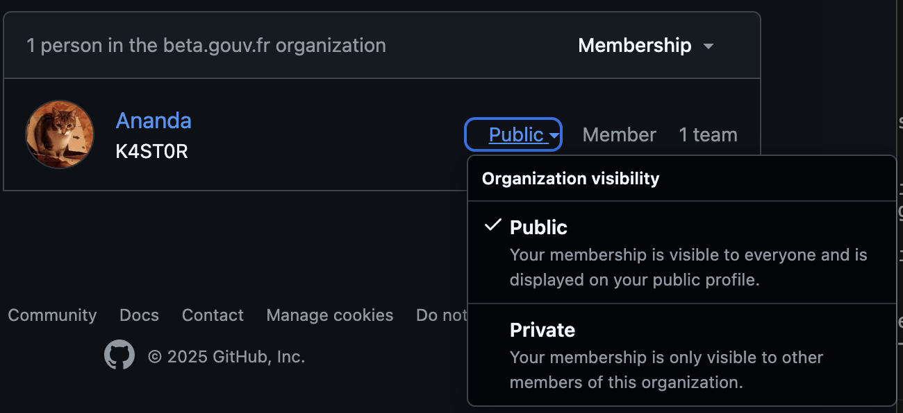

# Gestion de l'infrastructure

- [Prérequis](#prérequis)
  - [GPG](#gpg)
- [Configuration d'un nouveau cluster](#configuration-dun-nouveau-cluster)
- [Déclaration de l'environnement](#déclaration-de-lenvironnement)

## Prérequis

La configuration de l'infrastructure nécessite :

- [Terraform](https://developer.hashicorp.com/terraform) 1.12+ : Uniquement nécessaire pour la configuration du cluster Kubernetes
- [Ansible](https://docs.ansible.com/) 2.18+
- [Helm](https://helm.sh/) 3.14+
- [Kubectl](https://kubernetes.io/fr/docs/tasks/tools/install-kubectl/) 1.32+
- [Kubelogin](https://github.com/int128/kubelogin) 1.34+
- [Docker](https://docs.docker.com/) 28.3+

### GPG

Pour utiliser le projet infra, vous devez avoir une clé GPG, si ce n'est pas le cas, vous pouvez en créer une via la
commande :

```bash
 bash scripts/create-gpg-key.sh <prénom> <nom> <email>
```

Une fois terminé, le script va vous indiquer l'identifiant de votre clé GPG. Afin qu'elle puisse être utilisée au sein
de la mission apprentissage, vous devez publier votre clé :

```bash
gpg --send-key <identifiant>
```

Il est vivement conseillé de réaliser un backup des clés publique et privée qui viennent d'être créés.

```bash
gpg --export <identifiant> > public_key.gpg
gpg --export-secret-keys <identifiant> > private_key.gpg
```

Ces deux fichiers peuvent, par exemple, être stockés sur une clé USB.

## Configuration d'un cluster

Avant de pouvoir configurer votre cluster il est nécessaire de :

- créer un object storage via l'interface d'OVH : https://www.ovhcloud.com/fr/public-cloud/object-storage/
- créer un registry privé via l'interface d'OVH : https://www.ovhcloud.com/fr/public-cloud/managed-private-registry/
- créer un réseau privé via l'interface d'OVH : https://www.ovhcloud.com/fr/public-cloud/private-network/
- créer un cluster Kubernetes associé au réseau privé via l'interface d'OVH : https://www.ovhcloud.com/fr/public-cloud/kubernetes/
  - Pour permettre à un utilisateur de se connecter au cluster à l'aide de son compte GitHub, il vous faudra également configurer un fournisseur OIDC dans la configuration du cluster :
    - Provider URL (Obligatoire) : URL du provider (champs `dex_domain` [env.ini](/.infra/env.ini))
    - Client ID : `kubectl`
    - groupsClaim : `groups`
    - usernameClaim : `preferred_username`
    - usernamePrefix : `-`

Il vous faudra lors remplir la partie `setup` du [vault](./vault.md) avec les informations nécessaires.

Lors de la mise en place pour la première fois du cluster, il vous sera nécessaire d'utiliser le `kubeconfig` fourni depuis l'interface OVH.

Pour configurer un nouveau cluster ou le mettre à jour, il faut lancer la commande suivante :

```
bash scripts/setup-cluster.sh
```

Cette commande configurera le cluster de la façon suivante :

- Installation d'un ingress Nginx et d'un loadbalancer associé
  - L'IP du loadbalancer est conservé lors d'une reconfiguration du cluster (voir `loadbalancer_ip` dans [env.ini](/.infra/env.ini))
- Installation d'un gestionnaire de certificat
- Installation des services de monitoring :
  - Stack Grafana+Prometheus+Loki+Alloy
  - Configuration de dashboards et d'alertes de base
  - Configuration d'une URL pour grafana (voir `monitoring_host` dans [env.ini](/.infra/env.ini))
- Installation d'un service d'identité OIDC (Dex avec le connecteur GitHub) et ajout des utilisateurs habilités

Il est nécessaire de déclarer l'IP du loadbalancer dans alwaysdata en ajoutant un enregistrement DNS :

```
A	<nom de l'application>	<IP>
A	*.<nom de l'application>	<IP>
```

## Déclaration de l'environnement

Le fichier `env.ini` définit les environnements de l'application. Il faut donc ajouter le nouvel environnement
dans ce fichier en renseignant les informations suivantes :

```
[<nom de l'environnemnt>]
<nom de l'environnemnt>-localhost ansible_host=127.0.0.1 ansible_connection=local  ansible_python_interpreter={{ansible_playbook_python}}
[<nom de l'environnemnt>:vars]
env_type=<nom de l'environnemnt>
env_name=<nom de l'environnemnt>
dns_name=<nom de l'application>.inserjeunes.beta.gouv.fr
app_namespace=<nom du namespace>
```

Editer le vault pour créer les env-vars liés à ce nouvel environnement (cf: [Vault](./vault.md))

## Accès au cluster

Pour pouvoir accèder au cluster, déployer l'application ou exécuter des jobs, une authentification est nécessaire.

Vous devez avoir un compte GitHub et ce dernier doit être configurer dans les habilitations (voir `Habilitations` dans [Gestion des secrets](./vault.md)).

Ce compte doit également faire partie de l'organisation `betagouv` et vous devez configurer votre appartenance à l'organisation comme étant public :


On utilise Dex en tant que OIDC provider qui permet de vous authentifier au cluster via kubelogin.

Exemple de commandes de configuration des accès dans votre `kubeconfig` :

```
kubectl config set-cluster CQLP \
  --server=ADRESSE_DU_CLUSTER \
  --certificate-authority-data=CA_PUBLIC_DU_CLUSTER \
  --embed-certs=true

kubectl oidc-login setup \
 --oidc-issuer-url=https://dex.futurpro.inserjeunes.beta.gouv.fr \
 --oidc-client-id=kubectl \
 --oidc-client-secret=kubectl-secret

kubectl config set-credentials NOM_UTILISATEUR_GITHUB \
 --exec-api-version=client.authentication.k8s.io/v1beta1 \
 --exec-command=kubectl \
 --exec-arg=oidc-login \
 --exec-arg=get-token \
 --exec-arg=--oidc-issuer-url=https://dex.futurpro.inserjeunes.beta.gouv.fr \
 --exec-arg=--oidc-client-id=kubectl \
 --exec-arg=--oidc-client-secret=kubectl-secret \
 --exec-arg=--oidc-extra-scope=profile

kubectl config set-context github-context \
 --cluster=CQLP \
 --user=NOM_UTILISATEUR_GITHUB

kubectl config use-context github-context
```

Vous pouvez désormais communiquer avec le cluster via kubectl.
