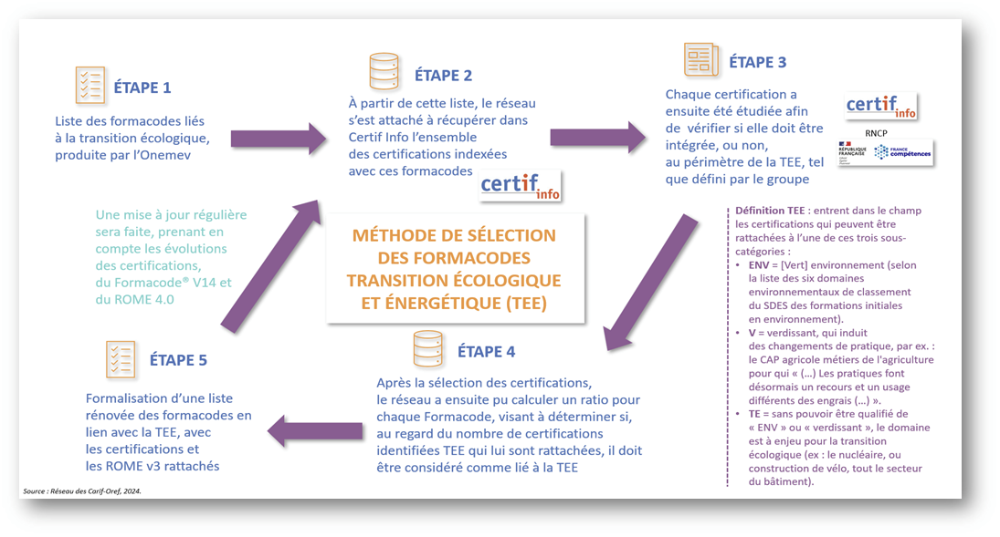

# Liste évolutive des formacodes liés à la transition écologique
{: .no_toc }

- TOC
{:toc}

La délégation générale à l’Emploi et la Formation professionnelle (*DGEFP*) du ministère du Travail, de la Santé, des Solidarités et des Familles a missionné le Réseau des Carif-Oref (*RCO*) afin d’identifier les formations et les certifications en lien avec la transition écologique via le Formacode®, outil d’indexation et de référence pour tous les acteurs de la formation professionnelle.

Détail sur l’étape 4
Une fois la codification faite pour toutes les certifications, un ratio a été calculé afin d’arbitrer si un formacode doit être ou non retenu, au regard des codifications des certifications qui lui sont rattachées. La part des certifications codées « oui » pour la TEE dans un formacode a été pondérée par le nombre de certifications dans ce formacode. Étant donnée l’hétérogénéité du nombre de certifications rattachées à un formacode, les seuils du ratio ont été déterminés à partir de deux étapes : une première étape pour prendre en compte le volume des certifications dans chaque formacode et une seconde pour classer le formacode dans le champ TEE en fonction du poids qu’elles représentent :

- nombre de certifications strictement inférieur à 5 : le formacode est retenu si 40 % de oui pour la TEE ;
- nombre de certifications compris entre 5 et 9 inclus : le formacode est retenu si 60 % de oui pour la TEE ;
- nombre de certifications égal ou supérieur à 10 : le formacode est retenu si 70 % de oui pour la TEE.

230 formacodes ressortent ainsi en lien avec la « Transition écologique ». La liste a ensuite été rebalayée afin de vérifier la codification. 6 formacodes, bien que ne rentrant pas dans les critères ci-dessus, mais étant très proches, ont été ajoutés à la liste. En effet, pour ceux-ci, même si les fiches de certifications ne font pas particulièrement ressortir des éléments liés à la TEE, ils y sont fortement liés ou portent de forts enjeux en termes de TEE.

## Périmètre

Ensemble des certifications disposant de formacodes.

## Périodicité de mise à jour

- Fréquence de mise à jour par le producteur inconnue
- Les données sont mises à jour dans notre base automatiquement chaque semaine dans le cadre d'un import global

## Format des données

Les données sont disponibles au format XSLX

## Entité responsable

Réseau des Carif-Oref

## Source

- [Accéder à la page du fichier sur data.gouv](https://www.data.gouv.fr/fr/datasets/une-liste-evolutive-des-formacodes-lies-a-la-transition-ecologique/)

## Utilisation

Les données sont mobilisées pour permettre aux utilisateurs d'identifier les formations particulièrement liées aux enjeux de la transition écologique.