# Page de détail
{: .no_toc }

*Retrouvez ci-dessous la liste des jeux de données affichés sur la page de détail. Pour une descritpion "produit" de cette page, rendez-vous [ici]({{ site.baseurl }}).*

- TOC
{:toc}

## En-tête

### Informations générales

#### Objectif
{: .no_toc }

Fournir à l'utilisateur des informations générales sur la formation et l'établissement.

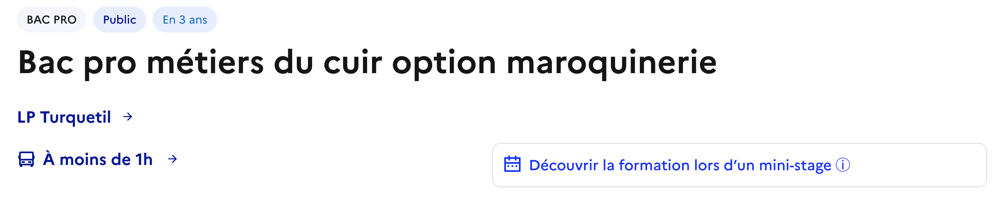

#### Données manipulées
{: .no_toc }

- Les informations sur l'établissement (nom, statut, dates des journées portes ouvertes et site web) sont issues des catalogues de base, de la table [ACCÉ]({{ site.baseurl }}) et de la table [Structures d'enseignement secondaire de l'Onisep]()
- Les informations sur les formations (diplôme, voie, durée de formation, nom) proviennent des catalogues de base, de la table [Formations Initales de l'Onisep]() et des [tables de la BCN]({{ site.baseurl }})
- La distance est issue du calcul des isochrones mentionné dans [la page de recherche]({{ site.baseurl }})

#### Traitements
{: .no_toc }

- Voir [la page de recherche]({{ site.baseurl }}) pour les traitements liés au calcul des isochrones

### Aperçu / Menu

#### Objectif
{: .no_toc }

Afficher quelques indicateurs permettant de résumer le contenu de la page (et permettre la navigation au sein de cette page).

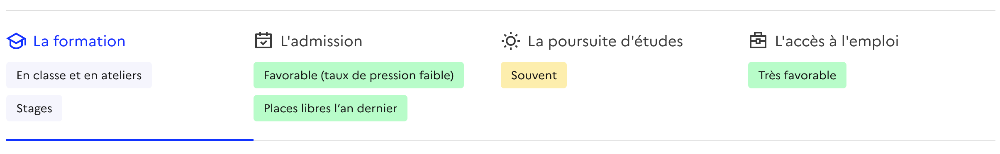

#### Données manipulées
{: .no_toc }

- Les labels de la section "La formation" sont des textes fixes associés à l'apprentissage ou à la voie scolaire.
- Les labels de la section "L'admission" sont calculés à partir des données issues du [SLA Affelnet]({{ site.baseurl }})
- Les labels de la section "La poursuite d'études" et "L'accès à l'emploi" sont calculés à partir des données de l'[API Exposition InserJeunes]({{ site.baseurl }})

#### Traitements
{: .no_toc }

- "L'admission". Le taux de pression est calculé au niveau formation x établissement si et seulement si la capacité est > 5, l'établissement est public et les 2 données (capacité ET voeux 1) existent. Les labels sont alors : 
  - “Favorable (taux de pression faible)” si le taux de pression est inférieur à 1.0.
  - “Assez difficile (taux de pression modéré)” si le taux de pression est entre 1.0 et Q3 (valeur correspondante au Q3 : 25% des formations ont un taux supérieur)
  - "Très difficile (taux de pression élevé)” si le taux de pression est supérieur à Q3
  - “Difficulté d’intégration indisponible” si le taux de pression n'est pas disponible
- "La poursuite d'études". La part en poursuite d’études est le nombre de jeunes qui poursuivent des études rapporté à l'effectif total de la dernière année de formation. On observe les valeurs seuils (quartiles Q1 et Q3), relatives à la région et au type de diplôme proposé. Les labels sont alors : 
  - "Différente selon le Bac Pro choisi après cette seconde commune" pour les familles de métiers
  - "Très souvent" si la part en poursuite d’études est supérieure à Q3
  - "Souvent" si la part en poursuite d’études est supérieure à Q1 et inférieure à Q3
  - "Peu souvent" si la part en poursuite d’études est inférieure à Q1 
  - "Consulter le taux régional" si la part n'est pas disponible mais que des informations sont disponibles au niveau régional pour la formation 
  - "Taux de poursuite d'études indisponible" sinon
- "L'accès à l'emploi". Le taux d'emploi est le nombre de jeunes inséré dans l'emploi (à 6 mois) rapporté à l'effectif total des sortants. On observe les valeurs seuils (quartiles Q1 et Q3), relatives à la région et au type de diplôme proposé. Les labels sont alors :
  - "Différente selon le Bac Pro choisi après cette seconde commune" pour les familles de métiers
  - "Très favorable" si le taux d’emploi est supérieur à Q3
  - "Dans la moyenne" si le taux d’emploi est supérieur à Q1 et inférieur à Q3
  - "Plutôt difficile" si le taux d’emploi est inférieur Q1
  - "Consulter le taux régional" si le taux n'est pas disponible mais que des informations sont disponibles au niveau régional pour la formation 
  - "Taux d'emploi indisponible" sinon

## Section "La formation"

### Description de la formation

#### Objectif
{: .no_toc }

Fournir un aperçu du contenu de la formation.

#### Données manipulées
{: .no_toc }

- [Fiches formations de l'Onisep]({{ site.baseurl }}) 

### Familles de métiers : liste des bac pro accessibles après la seconde commune

#### Objectif
{: .no_toc }

Présenter les bacs pro disponibles à l'issue d'une seconde commune.
- Les cartes présentant les bacs pro dispensés dans l'établissement permettent d'accéder à la page de détail correspondante
 - Les cartes présentant les bacs pro non dispensés dans l'établissement permettent d'accéder à la page de recherche filtrée avec le nom du bac pro en question

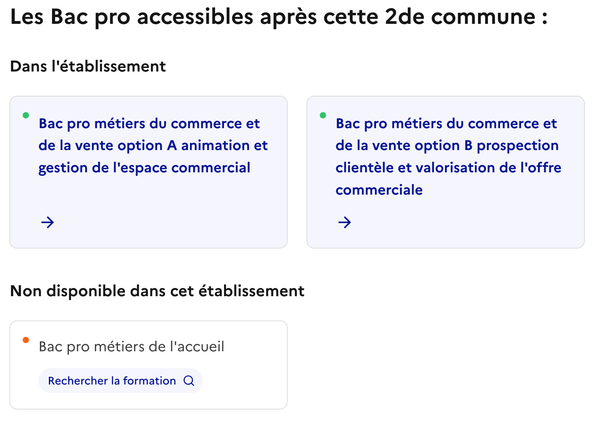

#### Données manipulées
{: .no_toc }

- Les données de la [table des familles de métiers de la BCN]({{ site.baseurl }}) sont recoupées avec le catalogue principal

## Section "L'admission"

### Familles de métiers : seconde commune permettant de rejoindre un Bac pro

#### Objectif
{: .no_toc }

Dans le cas d'un bac pro de famille de métiers, présenter la seconde commune permettant d'accéder à ce bac pro.

#### Données manipulées
{: .no_toc }

- Les données de la [table des familles de métiers de la BCN]({{ site.baseurl }}) sont recoupées avec le catalogue principal

### Description associée à l’admission

#### Objectif
{: .no_toc }

Fournir un aperçu des conditions d'admission dans la formation.

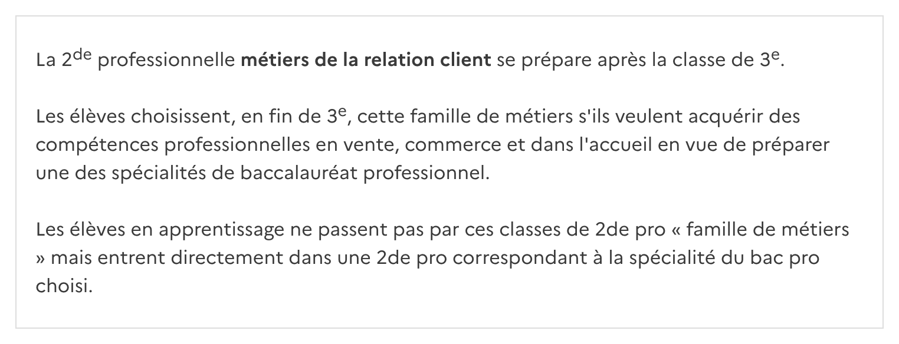

#### Données manipulées
{: .no_toc }

- [Fiches formations de l'Onisep]({{ site.baseurl }}) 

### Module “Difficulté d’admission”

#### Objectif
{: .no_toc }

Présenter pour les formations de la voie scolaire, les nombre de vœux, les places disponibles et le nombre d'élèves inscrits pour donner des indications détaillées sur le taux de pression et la difficulté d'admission.

Dans le cas de l'alternance, un texte d'aide fixe est affiché (conseils pour la recherche d'une entreprise notamment).

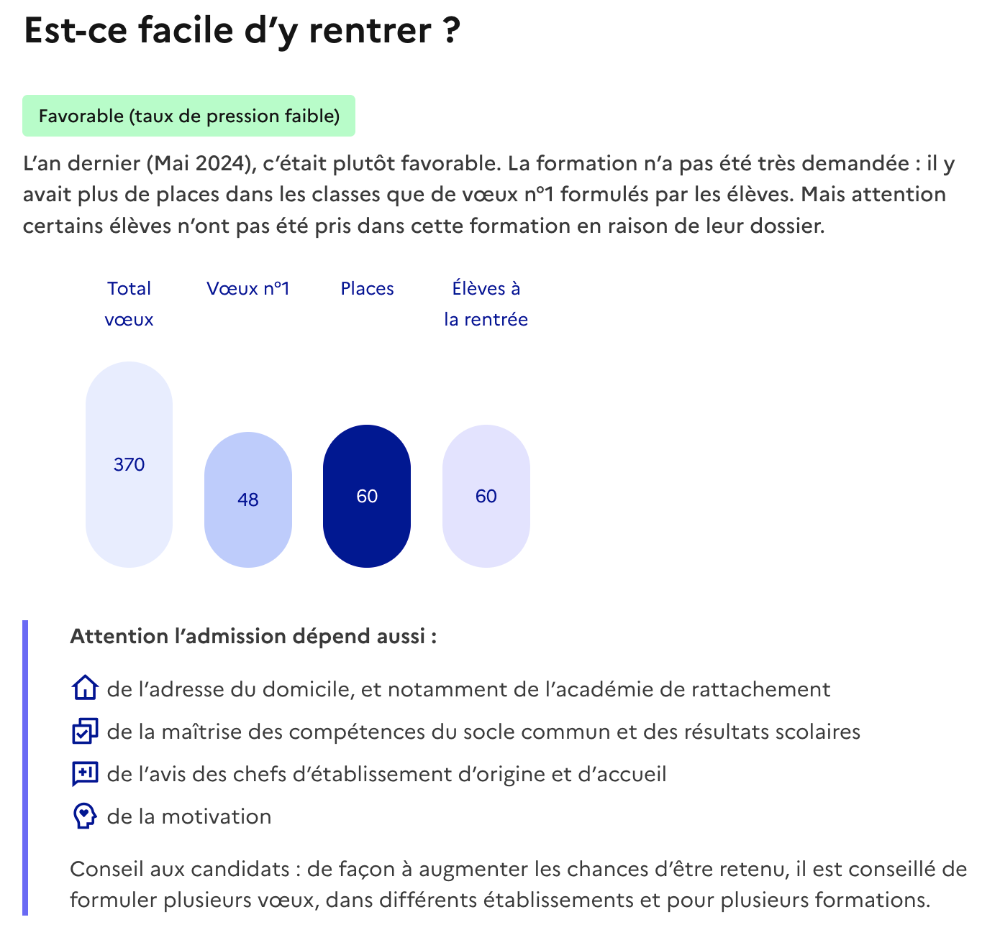

#### Données manipulées
{: .no_toc }

- Données issues du [SLA Affelnet]({{ site.baseurl }})

#### Traitements
{: .no_toc }

- Pour le calcul du label et le texte associé, voir la section "Aperçu / Menu"

### Module “Aides”

#### Objectif
{: .no_toc }

Fournir des indications sur les aides disponibles

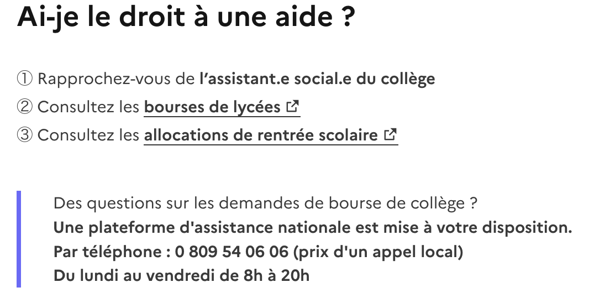

#### Données manipulées
{: .no_toc }

- Textes "en dur"

## Section "La poursuite d'études"

### Description associée à la poursuite d’études

#### Objectif
{: .no_toc }

Fournir un aperçu des poursuites d'études possibles à l'issue de la formation.

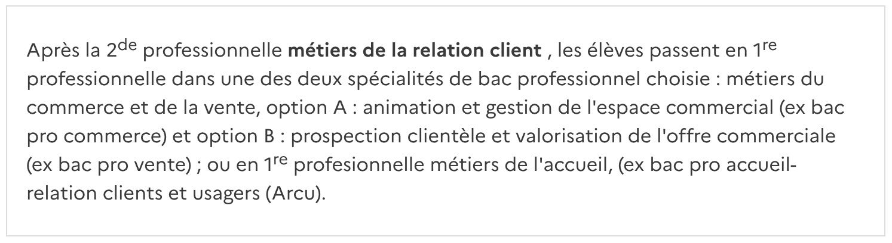

#### Données manipulées
{: .no_toc }

- [Fiches formations de l'Onisep]({{ site.baseurl }}) 

### Modules “études complémentaires”

#### Objectif
{: .no_toc }

Lister les poursuites d'études possibles à l'issue de la formation.

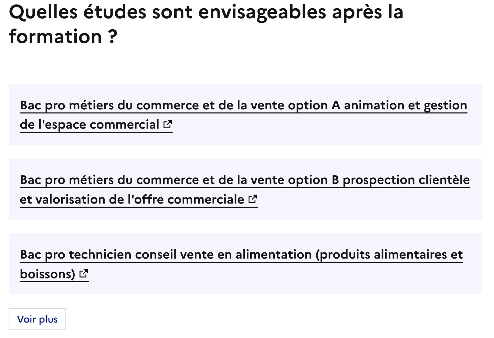

#### Données manipulées
{: .no_toc }

- [Fiches formations de l'Onisep]({{ site.baseurl }})

## Section "L'accès à l'emploi"

### Module sur le devenir des élèves

#### Objectif
{: .no_toc }

Donner un aperçu du devenir des élèves à horizon 6 mois.
Les données sont présentées à l'échelle de l'établissement (onglet par défaut) et de la région, si disponibles.

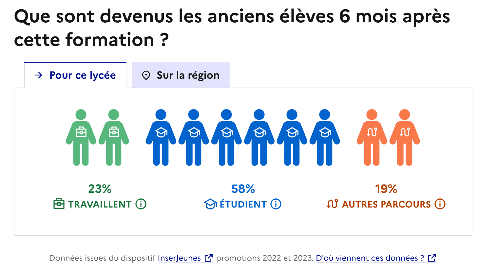

#### Données manipulées
{: .no_toc }

- données de l'[API Exposition InserJeunes]({{ site.baseurl }}) (parts en emploi et en formation)

#### Traitements
{: .no_toc }

### Modules sur les salaires en sortie de formation

#### Objectif
{: .no_toc }

Présenter les salaires médians, la distribution des salaires, et comparer le salaire médian à celui des autres formations de niveau équivalent.

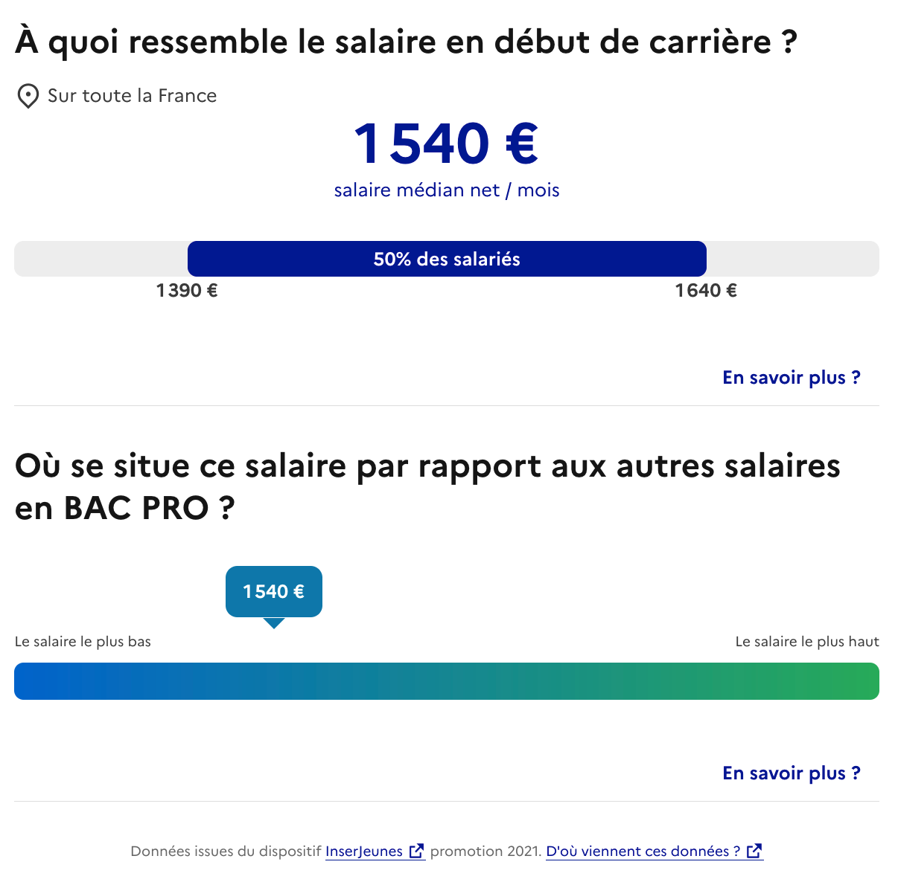

#### Données manipulées
{: .no_toc }

- données de l'[API Exposition InserJeunes]({{ site.baseurl }})

#### Traitements
{: .no_toc }

- le premier bloc présenter les données Q1, Q2 (médiane) et Q3
- le second positionne le salaire médian (Q2) sur une échelle dont le bord gauche représente le salaire médian le plus bas de tous les CAP (ou Bac Pro) et la droite le salaire médian correspondant au 9ème décile sur tous les CAP (ou Bac Pro). Les 10% de salaires les plus hauts sont placés au même endroit, à droite de l'échelle.

### Modules “métiers”

#### Objectif
{: .no_toc }

Présenter la liste des métiers qui sont les débouchés de la formation. Des labels correspondants aux métiers des transitions écologique, démographique et numérique sont affichés. Au clic, l'utilisateur est redirigé vers la fiche métier de l'Onisep ou de France Travail.

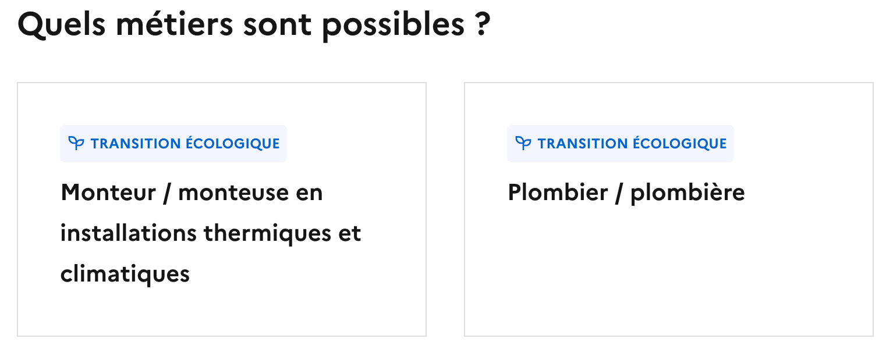

#### Données manipulées
{: .no_toc }

- [Certif-Info]({{ site.baseurl }}) permet de retrouver les ROME associés aux formations
- [Fiches métiers de l'Onisep]({{ site.baseurl }})
- [API France Travail]({{ site.baseurl }}) pour enrichir les informations sur les métiers et pour les labels des transition

## Bas de page

### Recommandations

#### Objectif
{: .no_toc }

Proposer à l'utilisateur des formations similaires permettant d'ouvrir de nouvelles perspectives dans le cadre de sa recherche de voeux. 

Les formations proposées sont des formations : 

- proches (au sens du RNCP)
- sur le territoire
- qui ont les devenirs les plus favorables (meilleurs taux d'emploi et de poursuite d'études cumulés)

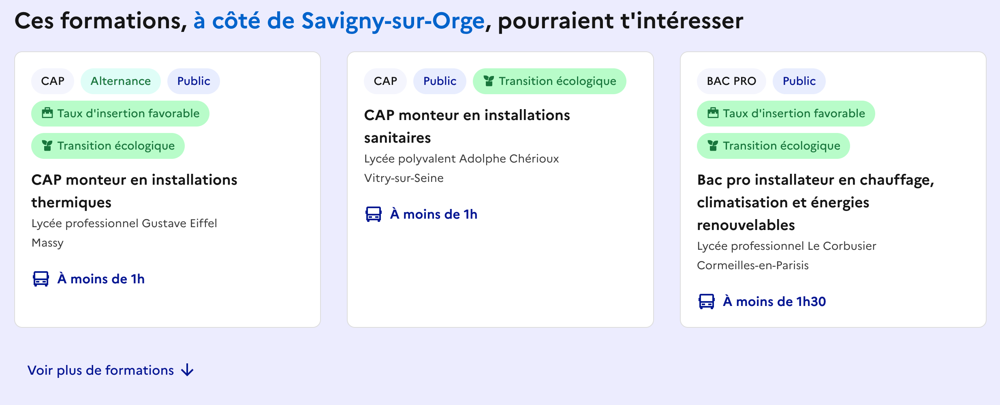

#### Données manipulées
{: .no_toc }

- [Certif-Info]({{ site.baseurl }})
- [RNCP]({{ site.baseurl }})
- [API Exposition InserJeunes]({{ site.baseurl }})

#### Traitements
{: .no_toc }

- [Calcul des proximités entre formation]({{ site.baseurl }})
- Pour une formation en établissement donnée, les suggestions sont contruites à partir du fichier de proximité ci-dessus. Pour chaque élément de la liste des formations les plus "proches" (au sens du score de proximité dans le fichier précédent) :
  - on regarde dans la zone “1h30 en transports” et si il y a plusieurs représentants on prend le premier en triant par type d'établissement (“public" puis "privé”), puis par “devenir favorable”
  - si pas de représentant accessible en transports, on regarde l’ensemble des formations de l’académie (même règles de tri pour choisir le représentant)
  - si on ne trouve toujours rien, on ignore la formation

