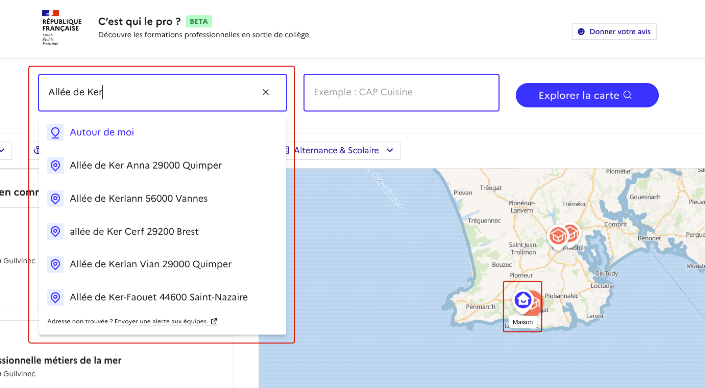
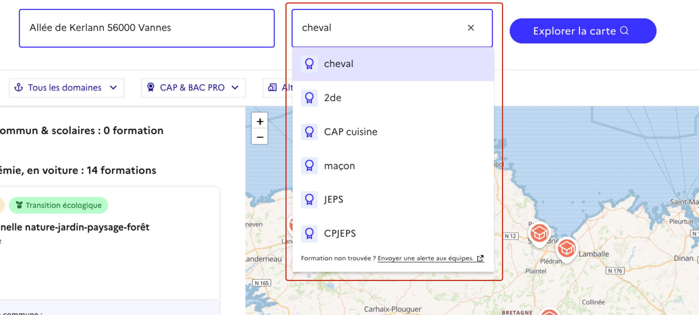
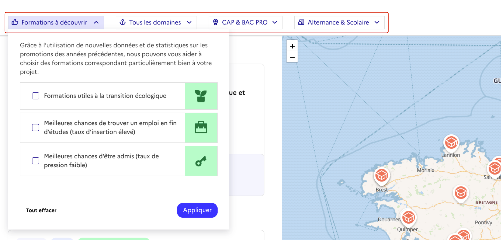
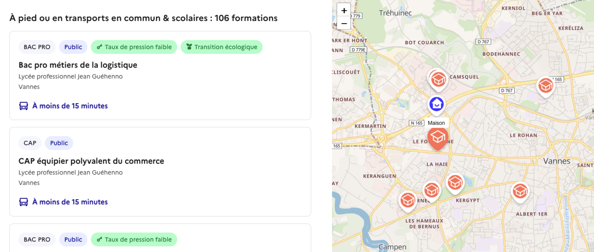

# Page de recherche
{: .no_toc }

*Retrouvez ci-dessous la liste des jeux de données affichés sur la page de Recherche. Pour une descritpion "produit" de cette page, rendez-vous [ici]({{ site.baseurl }}).*

- TOC
{:toc}

## Recherche géographique

### Objectif
{: .no_toc }

Le catalogue de formations, construit à partir de [la table Idéo-Actions de formation initiale-Univers lycée]({{ site.baseurl }}) et du [catalogue de l’apprentissage]({{ site.baseurl }}), peut-être parcouru par les utilisateurs.

La recherche se fait à partir d'une adresse, qui représente par exemple le domicile d'un élève. Cette adresse est renseignée dans un champ texte ou définie en déplaçant le pictogramme "Maison" sur la carte.

### Données manipulées
{: .no_toc }

- L'adresse du lieu à saisir est renseignée par l'utilisateur. Il dispose pour l'aider de son historique de recherche et de suggestions issues du [service de géocodage Géoplateforme](https://adresse.data.gouv.fr/outils/api-doc/adresse).
- L'adresse renseignée est transformée en coordonnées géographiques à partir de ce même [service de géocodage Géoplateforme](https://adresse.data.gouv.fr/outils/api-doc/adresse).
- Les coordonnées sont ensuites recoupées avec les isochrones calculés préalablement (environ une fois par mois) qui nécessitent de manipuler les données suivantes : 
  - Coordonnées GPS des établissements de formation, issues de la base [ACCÉ]({{ site.baseurl }})
  - Données des [transports en communs]({{ site.baseurl }})
  - Données des [transports scolaires]({{ site.baseurl }})
  - Données d'[OpenStreetMap]({{ site.baseurl }})
- L'affichage des "tuiles" sur la carte se fait à l'aide des [tuiles vectorielles fournies par Etalab](https://openmaptiles.geo.data.gouv.fr/)

### Traitements
{: .no_toc }

- [Traitements des PBF]({{ site.baseurl }})
- [Traitements des GTFS]({{ site.baseurl }})
- [Calcul des isochrones pour les transports en commun]({{ site.baseurl }})
- [Calcul des isochrones pour les transports scolaires]({{ site.baseurl }})

## Recherche textuelle

### Objectif
{: .no_toc }

La recherche géographique peut être affinée à l'aide d'un champ textuel permettant de renseigner un type de diplôme (par exemple Bac Pro"), un intitulé de diplôme (par exemple "CAP Cuisine"), un acronyme associé au diplôme (par exemple "AGORA") ou un mot-clé associé à la recherche (par exemple "cheval", "éléctricité" ou "nature").

Seuls les résultats correspondants à ces indications supplémentaires sont alors renvoyés.

### Données manipulées
{: .no_toc }

- [Fiches formations (Onisep)]({{ site.baseurl }}) pour les intitulés, les domaines et sous-domaines, acronymes, métiers, etc. et descriptions pour alimenter la génération des mots-clés
- [L'API ROME Métiers de France Travail]({{ site.baseurl }}) pour compléter les informations sur les métiers
- [Certif-Info]({{ site.baseurl }}) pour faire le lien entre les métiers et les formations

### Traitements
{: .no_toc }

- [Génération des mots-clés]({{ site.baseurl }})
- Un seuil minimal de proximité est mis en place sur les mots-clés pour éviter les associations peu judicieuses
- Nous utilisons [TypeSense](https://typesense.org/) pour améliorer la recherche, par exemple pour diminuer la sensibilité aux fautes d'ortographes.

## Filtres

### Objectif
{: .no_toc }

La recherche géographique peut être affinée à l'aide d'un ensemble de filtres permettant de sélectionner : 
- un ou plusieurs domaines
- un type de diplôme (CAP, Bac Pro)
- un type de voie (alternance, scolaire)
- des filtres particuliers : 
  - formations associées à la transition écologique
  - formations proposant un fort taux d'emploi en sortie
  - formations ayant un faible taux de pression en entrée

Seuls les résultats correspondants à ces filtres sont alors renvoyés.

### Données manipulées
{: .no_toc }

- [Formations initiales (Onisep)]({{ site.baseurl }}) pour le filtre par domaine
- le type de diplôme est issu des tables de la [BCN]({{ site.baseurl }})
- La voie est inférée depuis l'origine de la formation dans le catalogue (scolaire pour [Idéo-Actions de formation initiale-Univers lycée]({{ site.baseurl }}) et apprentissage pour le [catalogue de l’apprentissage]({{ site.baseurl }}))
- [Liste évolutive des formacodes liés à la transition écologique]({{ site.baseurl }}) pour filtrer les "Formations utiles à la transition écologique"
- [API Exposition InserJeunes]({{ site.baseurl }}) pour le filtre "Meilleures chances de trouver un emploi en fin d’études (taux d’insertion élevé)"
- [Données issues du SLA Affelnet]({{ site.baseurl }}) pour le filtre "Meilleures chances d’être admis (taux de pression faible)"

### Traitements
{: .no_toc }

- Le fichier [Certif-Info]({{ site.baseurl }}) est utilisé comme table de passage vers la [liste évolutive des formacodes liés à la transition écologique]({{ site.baseurl }})
- Les formations offrant de "Meilleures chances de trouver un emploi en fin d’études (taux d’insertion élevé)" sont celles ayant un taux d'emploi supérieur au Q3 (3ème quartile) pour le type de diplôme proposé (CAP, Bac Pro) au sein de la région.
- Les formations offrant de "Meilleures chances d’être admis (taux de pression faible)" sont celles ayant un taux de pression inférieur à 1.0

## Affichage des résultats

### Objectif
{: .no_toc }

Les formations renvoyées sont affichées : 
- en liste, avec un item par formation
- sur une carte, avec un "pin" par établissement dispensant une formation

Le clic sur un "pin" de la carte permet de : 
- faire défiler la liste jusqu'aux formations dispensées par l'établissement
- afficher des informations sur l'établissement (nom, lien vers le site web, durée de transport depuis l'adresse renseignée)

Les éléments de la liste sont affichés par temps de trajet : les formations dispensées dans des établissements situés à moins de 15min, 30min, 45min, 1h, 1h30 à pied, en transports en commun ou en transports scolaires. Les formations des établissement restants sont ensuite affichés par distance kilométrique croissante.

Un clic sur un élément de la liste permet d'accéder à [la fiche de détail]({{ site.baseurl }}).

Chaque cellule présente différentes informations : 
- type de diplôme
- type de voie
- nature de l'établissement (public, privé sous contrat, etc.)
- nom du diplôme
- nom de l'établissement
- ville de l'établissement
- durée de transport depuis l'adresse renseignée
- date des journées portes ouvertes

### Données manipulées
{: .no_toc }

- Les informations sur l'établissement (nom, statut, ville, dates des journées portes ouvertes et site web) sont issues des catalogues de base, de la table [ACCÉ]({{ site.baseurl }}) et de la table [Structures d'enseignement secondaire de l'Onisep]()
- Les informations sur les formations (diplôme, voie, nom) proviennent des catalogues de base, de la table [Formations Initales de l'Onisep]() et des [tables de la BCN]({{ site.baseurl }})
- La distance est issue du calcul des isochrones mentionné plus haut
