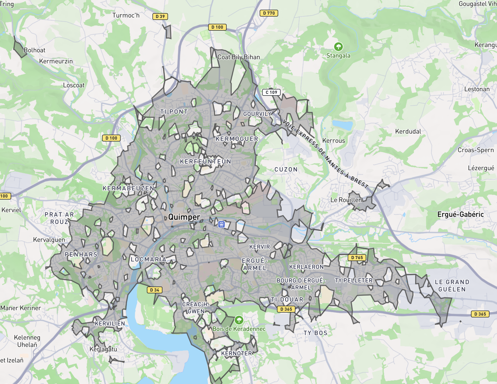

# Calcul des isochrones de transports en commun
{: .no_toc }

- TOC
{:toc}

## Pourquoi mettre en place ce traitement ?

Futur pro permet, à partir d'une adresse renseignée par l'utilisateur, d'afficher une liste de formations dispensées dans des établissements accesibles (marche et transports en commun ou scolaires) depuis cette adresse. Pour chaque résultat, une indication du temps de trajet est fournie.

Une approche "naïve" consisterait à effectuer, lors de la saisie de l'adresse, un calcul de temps de trajet (comme lorsque vous utilisez un service comme Citymapper ou Google Maps) entre cette adresse et chaque établissement, afin de sélectionner les établissements accessibles et de pouvoir afficher les temps de trajet correspondants. Une telle opération est malheureusement très coûteuse et trop longue pour permettre une réponse en temps réel.

Pour fournir une réponse plus rapide et permettre une utilisation correcte du service :

- nous avons choisi de manipuler et d'afficher dans le produit des fourchettes de durées de trajet plutôt que des durées exactes. Les temps de trajets sont de "moins de 15min", "entre 15 et 30min", "entre 30 et 45min", "entre 45min et 1h", "entre 1h et 1h30" ou de "plus de 1h30".
- nous pré-calculons un ensemble d'informations, qui sont utilisées au moment de la recherche pour accélerer le temps de réponse.

En pratique :

- nous calculons, environ une fois par mois, pour chaque établissement, les zones accessibles depuis cet établissement en moins de 15, 30, 45, 60 et 90 minutes (les "isochrones", voir illustration ci-dessous) et stockons ces formes géométriques en base.
- au moment de la recherche, nous regardons si l'adresse renseignée se situe ou non dans ces zones. Les établissements dont les zones contiennent le point correspondant à l'adresse sont accessibles et renvoyés par la recherche.

Ce calcul d'intersection effectué au moment de la recherche est bien plus rapide que le calcul de multiples temps de trajets de l'approche "naive" et permet de répondre à notre besoin.

*Exemple d'isochrone calculé depuis le centre-ville de Quimper*

## Données utilisées

- [Fichiers PBF traités]({{ site.baseurl }})
- [Fichier GTFS traites]({{ site.baseurl }})

## Utilitaire utilisés

- [Graphhopper](https://github.com/graphhopper/graphhopper) :
  - Permet le calcul d’un itinéraire entre deux endroits
  - Permet de créer un isochrone en partant d’un endroit (Géométrie de tout les endroits accessibles en X temps)
- PostgreSQL avec l’extension [PostGis](https://postgis.net/)
- Jobs en cli :
  - [`splitIsochrones`](https://github.com/mission-apprentissage/c-est-qui-le-pro/blob/main/server/src/cli.ts#L182)
  - [`importIsochrones`](https://github.com/mission-apprentissage/c-est-qui-le-pro/blob/main/server/src/cli.ts#L213)

## Fonctionnement

- On importe les fichiers GTFS et PBF dans GraphHopper (on exclut les autoroutes dans la configuration de GraphHopper)
- On exporte la liste des établissements de notre catalogue et leur position géographique
- Pour chaque établissement on interroge GraphHopper afin d’obtenir un isochrone pour chaque durée de trajet maximale qui nous intéresse (ex: 1h30, 1h, …), on sauvegarde les résultats dans des fichiers.
- Pour chaque ensemble d’isochrones pour un établissement :
  - On simplifie les isochrones
  - On découpe les isochrones en plusieurs parties
- On importe nos isochrones simplifiés et découpés dans notre base de données.

## Scripts

- Création de l’instance GraphHopper, voir [Dockerfile](https://github.com/mission-apprentissage/c-est-qui-le-pro/tree/main/tools/isochrones/graphhopper) effectuant :
  - Le téléchargement et le traitements des GTFS et PBF
  - La création d’une instance GraphHopper utilisant ces données
- Création des Isochrones bruts, voir [Dockerfile](https://github.com/mission-apprentissage/c-est-qui-le-pro/tree/main/tools/isochrones/isochrones) :
  - Télécharge la liste des établissements avec leur position
  - Interroge GraphHoper et sauvegarde les isochrones dans des fichiers
- [Simplification et découpage des isochrones](https://github.com/mission-apprentissage/c-est-qui-le-pro/blob/main/server/src/jobs/isochrones/splitIsochrones.ts)
- [Importation des isochrones](https://github.com/mission-apprentissage/c-est-qui-le-pro/blob/main/server/src/jobs/isochrones/importIsochrones.ts)
