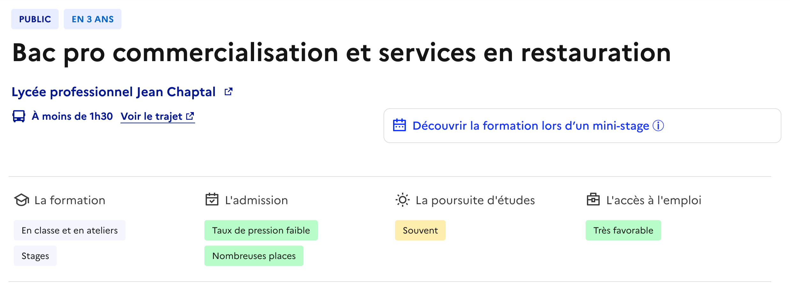
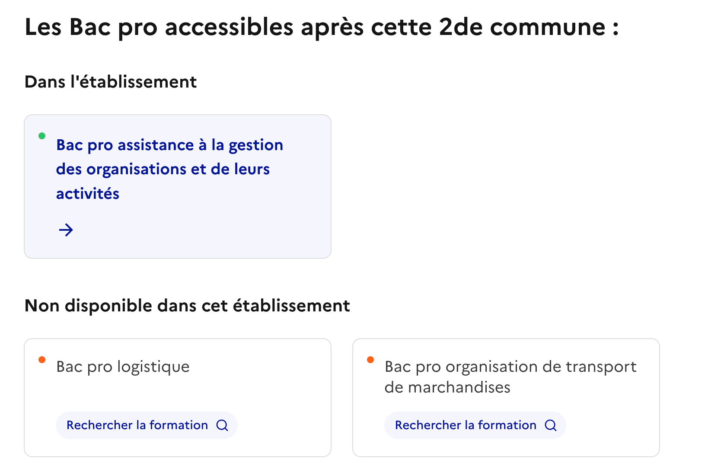
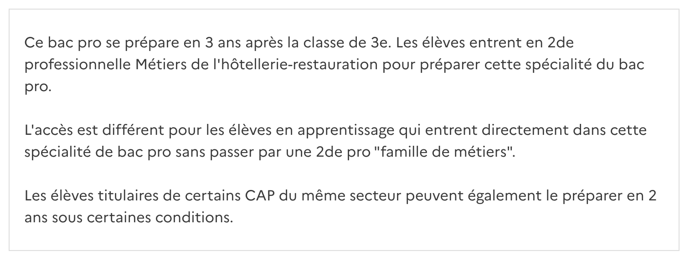
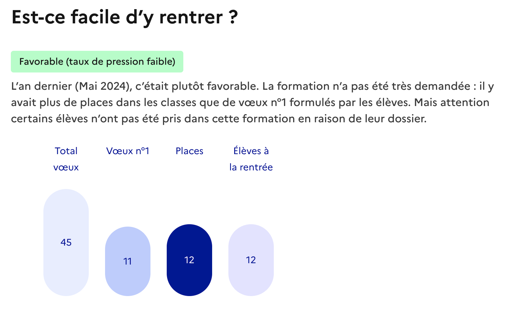
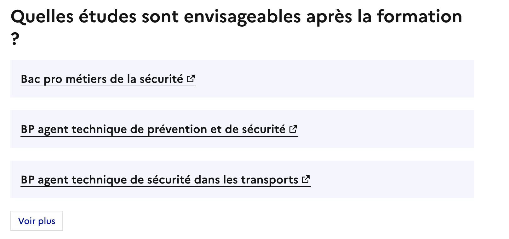
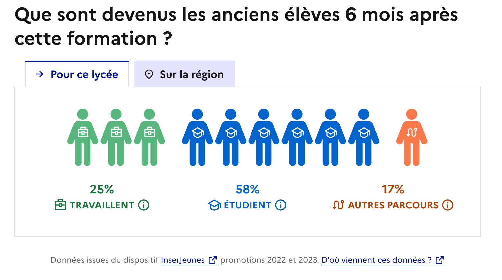
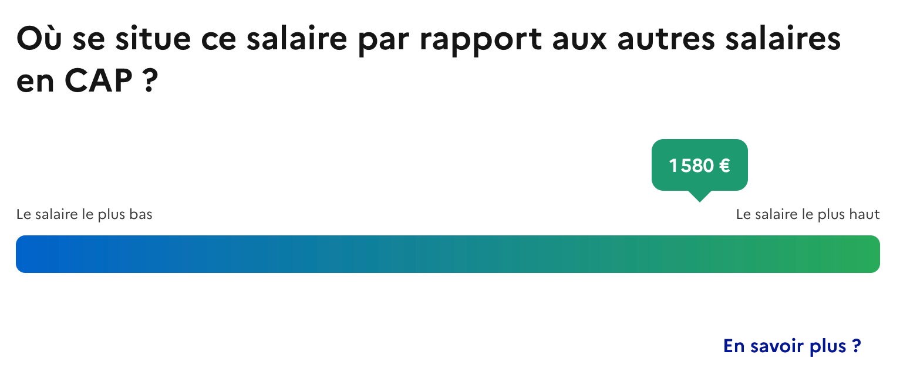
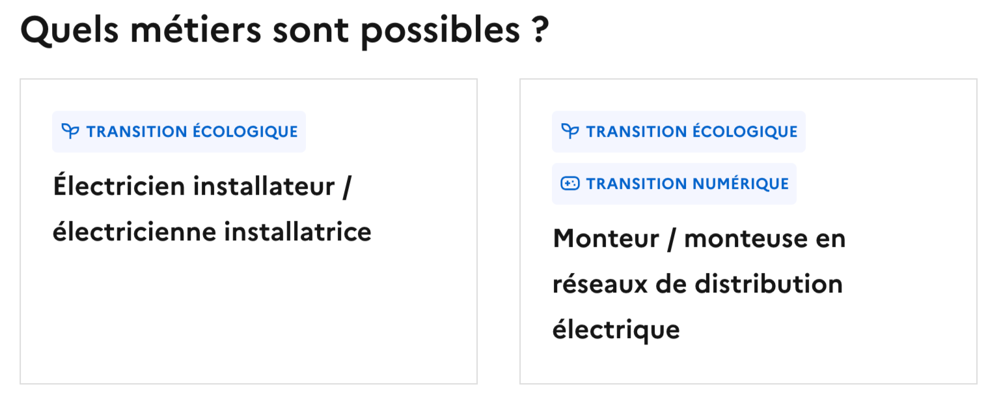
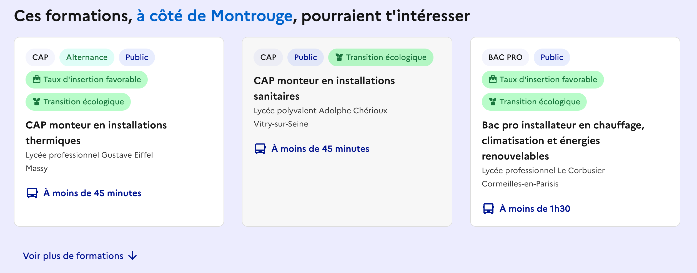

# 🏫 Page de détail de la formation
{: .no_toc }

- TOC
{:toc}

{: .highlight}
> ⚡️ La page de détail permet d’accéder des éclairages sur une formation donnée. Elle présente notamment des éléments sur : 
> 
> - le contenu de la formation
> - les conditions d’accès
> - le devenir des élèves, poursuite d’études et accès à l’emploi notamment

## Aperçu de la formation

La partie haute de la page de détail présente :

- un ensemble d’informations de base : nom du diplôme, durée de formation, statut public / privé, alternance ou scolaire, nom de l’établissement, dates des journées portes ouvertes
- des indications sur le temps d’accès nécessaire et le trajet pour se rendre dans l’établissement à partir de l’adresse renseignée dans la recherche
- un résumé, à l’aide de “tags” du contenu de la page. Ce résumé sert aussi de navigation et permet d’accéder directement aux différentes sections

*Exemple 1 : formation en alternance*

*Exemple 2 : formation en voie scolaire*

## Section “La formation”

### Description de la formation

Dans ce premier “module”, une description sommaire de la formation est présentée.

Un lien vers [Onisep.fr](http://Onisep.fr) permet d’accéder à des données approfondies sur le diplôme préparé dans cette formation.

*Origine des données : [Onisep.fr](https://opendata.onisep.fr/)*

### Familles de métiers : liste des bac pro accessibles après la seconde commune

Pour les secondes en voie scolaire appartenant à des [familles de métiers](https://www.onisep.fr/formation/apres-la-3-la-voie-professionnelle/les-diplomes-de-la-voie-pro/le-bac-professionnel/les-familles-de-metiers), la liste des Bac pro disponibles à l’issue de cette seconde commune est détaillée : d’abord les formations dispensées dans l’établissement (une page de détail peut être ouverte), puis celles qui ne le sont pas.

## Section “L’admission”

### Familles de métiers : seconde commune permettant de rejoindre un Bac pro

Pour les Bac pro en voie scolaire appartenant à des [familles de métiers](https://www.onisep.fr/formation/apres-la-3-la-voie-professionnelle/les-diplomes-de-la-voie-pro/le-bac-professionnel/les-familles-de-metiers), la seconde commune  disponible dans l’établissement concerné (si disponible) est présentée et la page de détail peut être ouverte au clic.

### Description associée à l’admission

Des indications sont fournies dans ce module sur les pré-requis et conditions d’accès de la formation.

*Origine des données : [Onisep.fr](https://opendata.onisep.fr/)*

### Module “Difficulté d’admission”

Dans ce module sont présentées des données relatives à la dernière campagne de voeux sur Affelnet : 

- Combien de voeux ont été fait vers cette formation ?
- Combien de premiers voeux ont été fait vers cette formation ?
- Combien de places étaient ouvertes dans la formation ?
- Combien d’élèves étaient inscrits dans cette formation à la rentrée ?

Cette brique permet de détailler les informations présentées en haut de page sur le “taux de pression”.

Un résumé, vulgarise l’information au dessus du graphique.

*Origine des données : SLA Affelnet*

Pour l’apprentissage, en l’absence de données sur le “taux de pression”, des indications sont apportées pour faciliter la recherche d’entreprise :

### Module “Aides”

Dans cette section sont apportées des indications pour aider les jeunes à en savoir plus sur les aides disponibles.

## Section “La poursuite d’études”

### Description associée à la poursuite d’études

Des indications sont ici présentées sur les études complémentaires accessibles à l’issue de la formation.

*Origine des données : [Onisep.fr](https://opendata.onisep.fr/)*

### Modules “études complémentaires”

La liste des formations complémentaires sur lesquelles la formation débouche couramment est présentée ici.

Au clic, la fiche “formation” correspondante est ouverte sur [Onisep.fr](http://Onisep.fr). 

*Origine des données :* [Onisep.fr](https://opendata.onisep.fr/)

## Section “L’accès à l’emploi”

### Module sur le devenir des élèves

Dans ce module, est présenté le devenir des élèves à l’issue de la formation : 

- Combien d’élèves ont trouvé un emploi salarié (public ou privé) ?
- Combien d’élèves ont poursuivi des études (études supérieurs, ré-orientation, redoublement) ?
- Combien sont dans d’autres parcours (chômage, inactivité professionnelle, indépendants, départ à l’étranger, formation “hors contrat”, etc.) ?

Les données sont calculées 6 mois après la formation.

Les données présentées par défaut sont les données assoicées à l'établissement. En cas d'absence, les données régionales sont affichées.

*Origine des données : [InserJeunes](https://documentation.exposition.inserjeunes.beta.gouv.fr/)*

### Module sur le salaire en sortie de formation

Dans ce module, est présenté une indication concernant le salaire des élèves issus de la formation.

Les données affichées présentent :

- Le salaire médian, qui divise les salariés en deux populations égales, avec 50% des salariés gagnant moins et 50% gagnant plus.
- La fourchette de salaire des 50% de salariés les plus proches du salaire médian, c'est-à-dire entre les 25% des salaires les plus bas et les 25% les plus hauts.

Les salaires sont des salaires nets (avant impôt sur le revenu), par mois, en équivalent temps-plein, observés 12 mois après la sortie de formation.

Attention, ces salaires sont indicatifs et observés à l'échelle de la France. Il existe une grande variabilité selon les territoires, les conditions de travail et les entreprises.

*Origine des données : [InserJeunes](https://documentation.exposition.inserjeunes.beta.gouv.fr/)*

### Module de positionnement des salaires

Ici le salaire médian est positionné sur une échelle allant du plus bas salaire médian au plus haut salaire médian, observés pour des formations délivrant un diplôme équivalent. Le graphique permet donc de comparer le salaire médian observé en sortie de formation aux autres formations délivrant un diplôme équivalent.
Pour une formation en CAP par exemple, on compare le salaire à tous les CAP pour lesquels des données sont disponibles.

Les salaires sont des salaires nets (avant impôt sur le revenu), par mois, en équivalent temps-plein, observés 12 mois après la sortie de formation.

Attention, ces salaires sont indicatifs et observés à l'échelle de la France. Il existe une grande variabilité selon les territoires, les conditions de travail et les entreprises.

*Origine des données : [InserJeunes](https://documentation.exposition.inserjeunes.beta.gouv.fr/)*

### Modules “métiers”

Dans cette section, les métiers sur lesquels la formation débouche habituellement sont présentés.

Les métiers associés à la transition écologique, la transition numérique ou la transition démographique sont mentionnés par des labels.

Au clic, une fiche “métier” est ouverte sur [Onisep.fr](http://Onisep.fr) ou [France Travail](https://www.francetravail.fr/).

*Origine des données : [Onisep.fr](https://opendata.onisep.fr/), [France Travail](https://francetravail.io/), [Référentiel national des certifications du Réseau des Carif-Oref](https://www.data.gouv.fr/fr/datasets/referentiel-national-des-certifications/)*

## Recommandations / suggestions

Dans cette dernière section sont présentées des suggestions de formations “proches” qui pourraient intéresser un jeune.

Pour le moment, ces formations sont proposées sur la base de leur “proximité” en terme d’environnement de travail, d’activités visées et de secteurs d’activité et type d’emploi.

*Origine des données : [France Compétences](https://www.francecompetences.fr/), [Référentiel national des certifications du Réseau des Carif-Oref](https://www.data.gouv.fr/fr/datasets/referentiel-national-des-certifications/)*