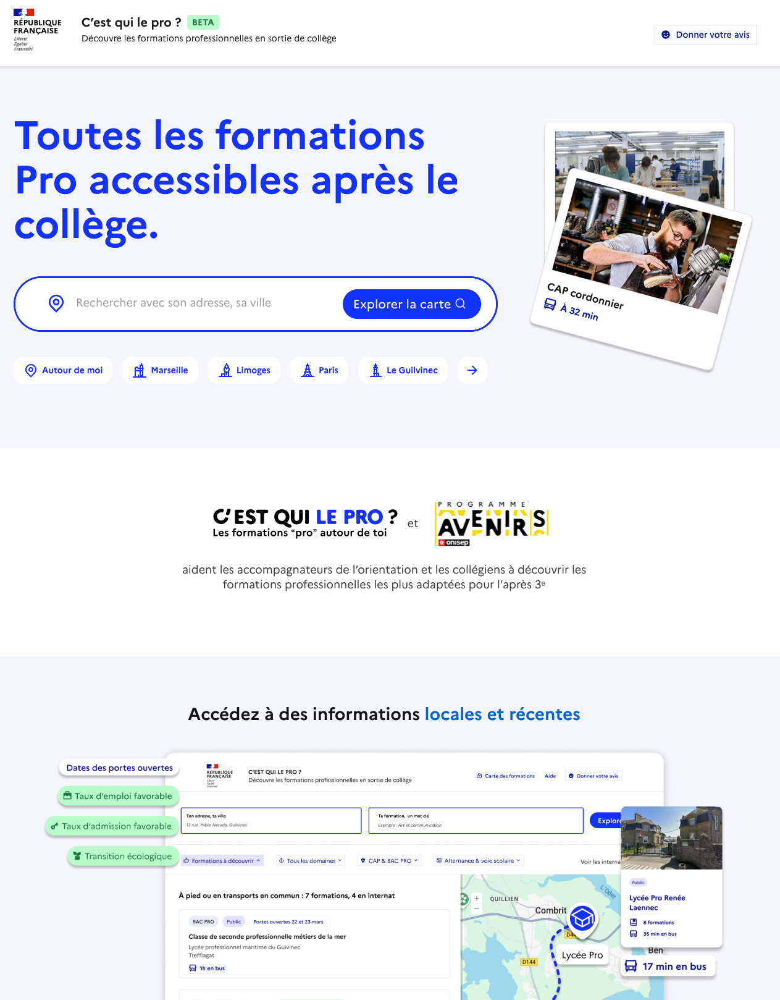
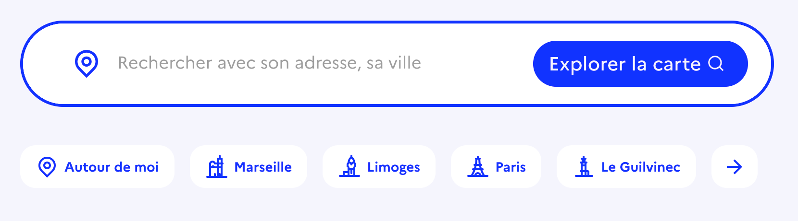
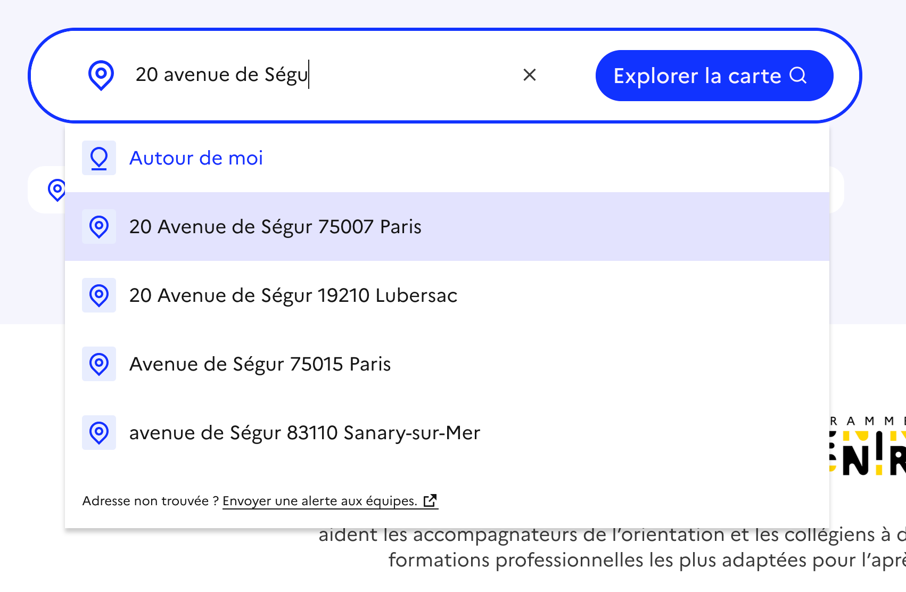

# 🎬 Page d'accueil
{: .no_toc }

- TOC
{:toc}

{: .highlight}
⚡️ La page d’accueil permet de se familiariser avec le service et de lancer une première recherche en renseignant une adresse.

# Lancer une première recherche

L’utilisateur peut renseigner une adresse dans le champ prévu à cet effet. Des boutons d'accès rapide permettent de tester le service dans différentes villes.

Un ensemble de suggestions est proposé pour aider l’utilisateur dans sa recherche. Celui-ci a aussi accès à l'historique de ses recherches.

Une fois l’adresse sélectionnée, l’utilisateur est redirigé vers la page de [Recherche]({{ site.baseurl }}). 

# Découvrir le service

Des informations sont présentées sur la page pour permettre de comprendre l'utilité du site et mettre en lumière certaines fonctionnalités importantes.