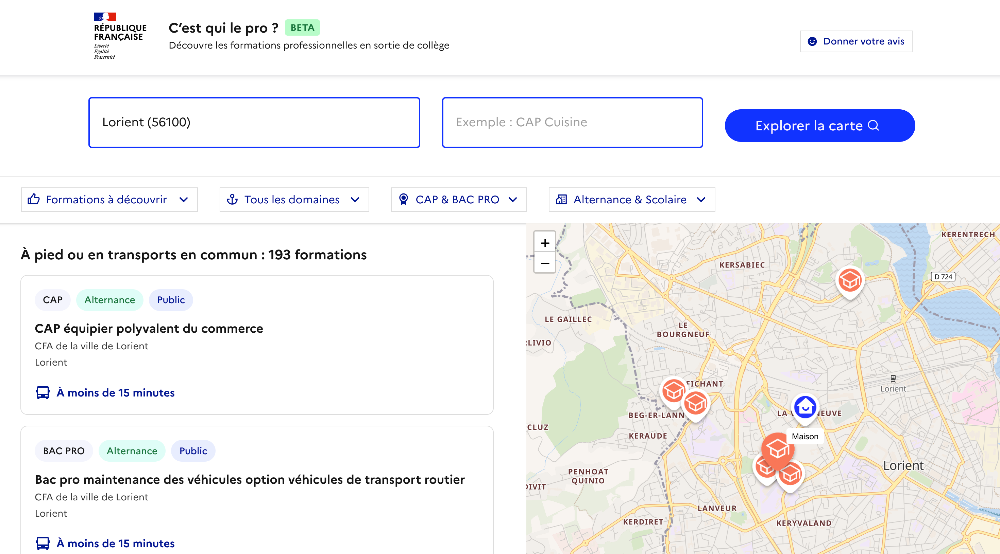
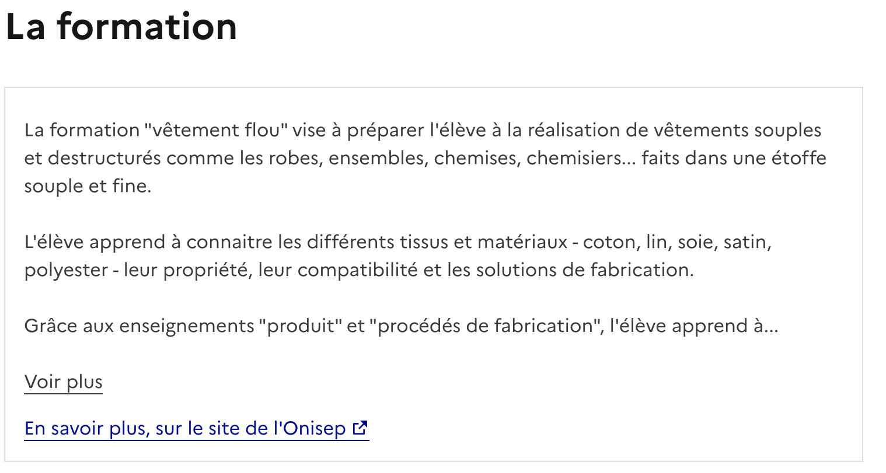
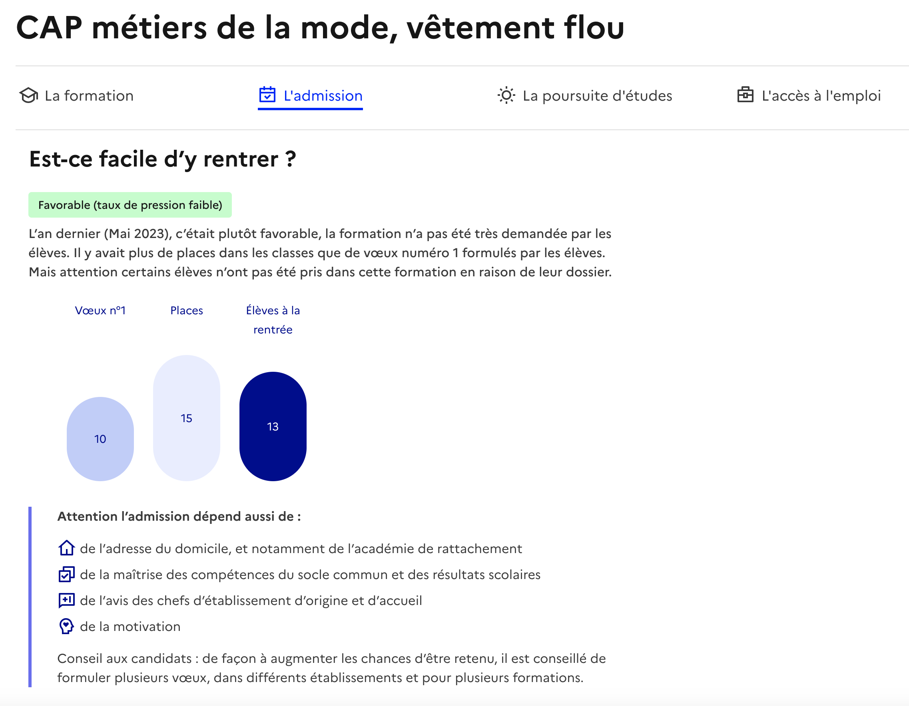
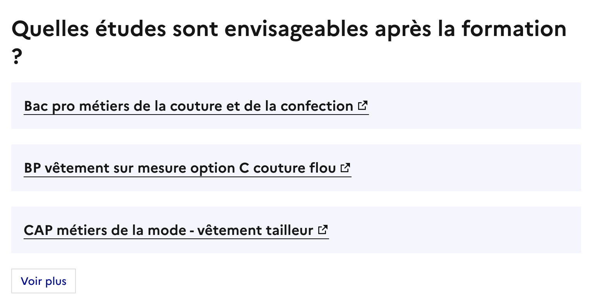
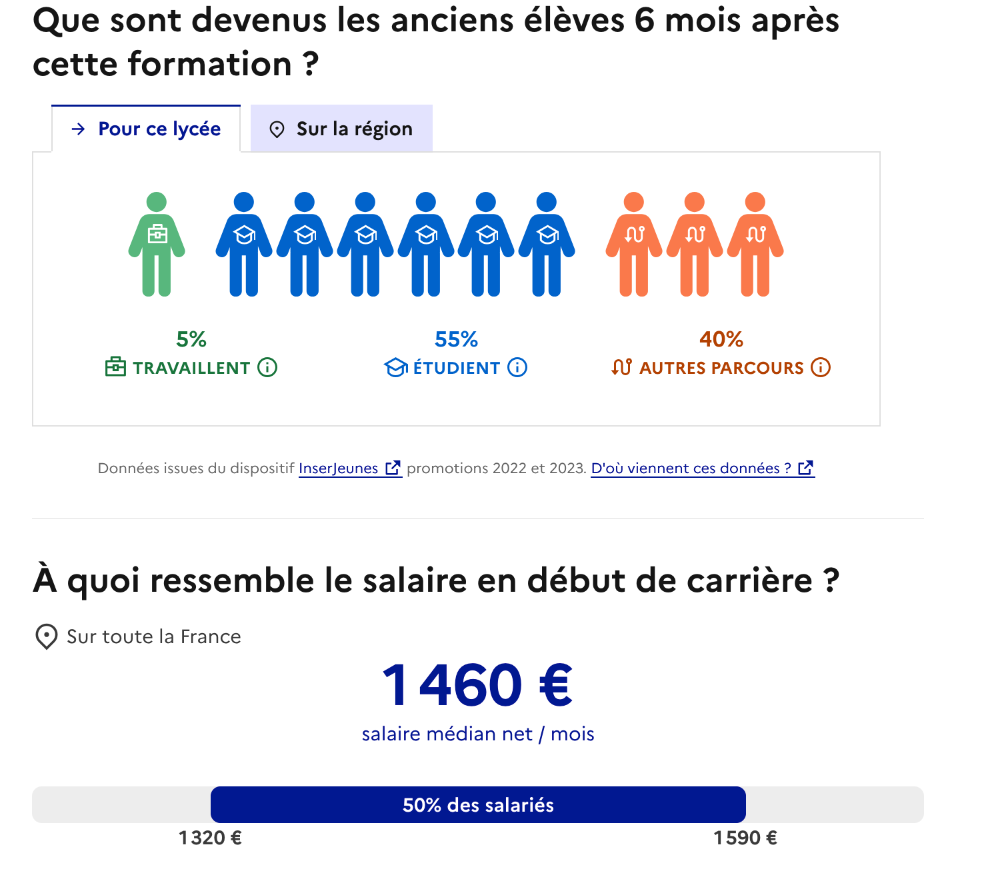
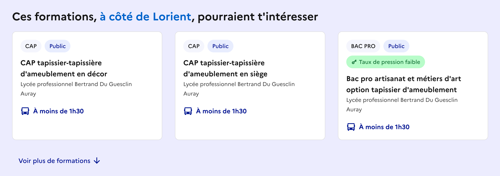

# ⚡️ Aperçu du site
{: .no_toc }

- TOC
{:toc}

## Je suis accompagnateur de l’orientation…

Professeur principal de collège, psychologue de l’éducation nationale, etc.

## Je souhaite…

- Mieux connaître l’offre de formation professionnelle autour de mon établissement (collège et CIO)
- Accompagner un élève dans sa recherche d’une formation professionnelle pour l’après-collège

## Alors je peux…

### Renseigner une adresse

Je saisis l’adresse du domicile de l’élève ou de mon établissement, depuis les pages [Accueil]({{ site.baseurl }}) ou [Recherche]({{ site.baseurl }})

### Voir les formations professionnelles disponibles autour de cette adresse

*Voir l’exemple pour une [recherche depuis Lorient](https://cestquilepro.inserjeunes.beta.gouv.fr/recherche?address=Lorient+%2856100%29)*

J’accède à un ensemble de résultats, d’abord situés dans un rayon d’1h30 à pied, en vélo ou en transports en commun ou scolaires, puis situés plus loin dans l’académie, accessibles par exemple en voiture.

Les formations présentées peuvent être en voie scolaire ou en alternance.

{: .note }
Bientôt disponible : je peux aussi découvrir des formations plus éloignées, mais disposant d’un internat ou proposant une solution d’hébergement.

### Filtrer les résultats

*Voir l’exemple depuis [Lorient, filtre arts, cultures, artisanat](https://cestquilepro.inserjeunes.beta.gouv.fr/recherche?address=Lorient+%2856100%29&domaines=arts%2C+culture%2C+artisanat)*

Je renseigne un domaine de prédilection, je choisis entre voie scolaire ou alternance, je précise un intérêt pour les formations de la transition écologique, je mentionne une envie de rentrer rapidement sur le marché de l’emploi, etc.

### Consulter une fiche détaillée

*Voir l’exemple du [CAP métiers de la mode, vêtement flou Lycée professionnel Louis Armand](https://cestquilepro.inserjeunes.beta.gouv.fr/details/50024240-241-0561507J-scolaire?latitude=47.750687&longitude=-3.378425)*

Pour chaque formation listée, je peux accéder à une fiche détaillée ([Page de détail de la formation]({{ site.baseurl }})) me permettant notamment d’en savoir plus sur : 

- **Le contenu de la formation**
    
    
    *[Voir l’exemple](https://cestquilepro.inserjeunes.beta.gouv.fr/details/50024240-241-0561507J-scolaire?latitude=47.750687&longitude=-3.378425#la-formation)*
    
- **Les conditions d’accès dans la formation**
    
    
    *[Voir l’exemple](https://cestquilepro.inserjeunes.beta.gouv.fr/details/50024240-241-0561507J-scolaire?latitude=47.750687&longitude=-3.378425#l-admission)*    

- **Les poursuites d’études possibles**
    
    
    *[Voir l’exemple](https://cestquilepro.inserjeunes.beta.gouv.fr/details/50024240-241-0561507J-scolaire?latitude=47.750687&longitude=-3.378425#poursuite-etudes)*

- **Des informations sur l’accès à l’emploi à l’issue de cette formation (devenir à 6 mois, rémunérations, métiers)**
    
    
    *[Voir l’exemple](https://cestquilepro.inserjeunes.beta.gouv.fr/details/50024240-241-0561507J-scolaire?latitude=47.750687&longitude=-3.378425#acces-emploi)*

- **Des recommandations de formations proches**
    
    
    *[Voir l’exemple](https://cestquilepro.inserjeunes.beta.gouv.fr/details/50024240-241-0561507J-scolaire?latitude=47.750687&longitude=-3.378425)*