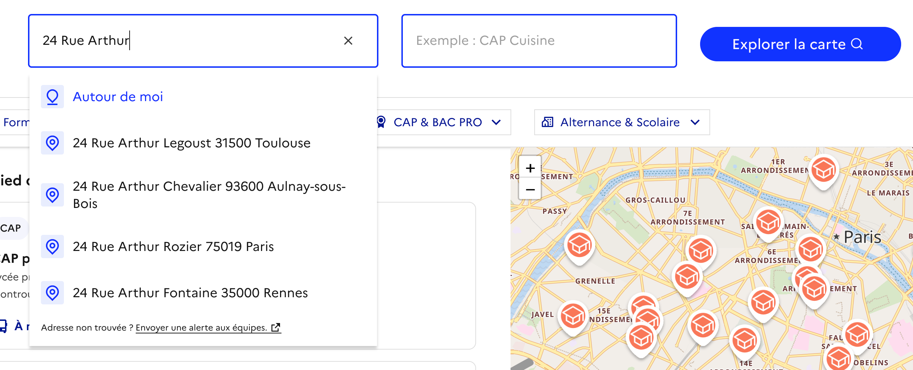
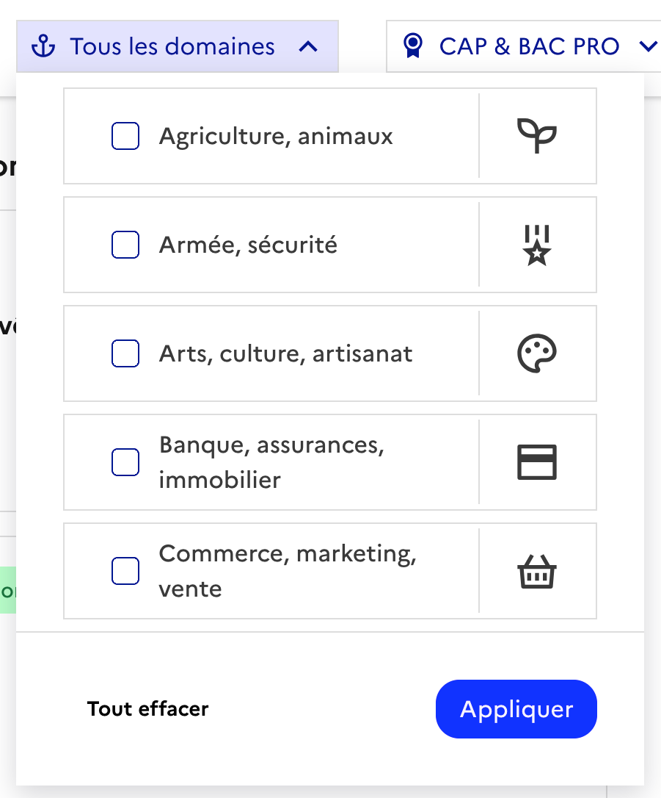
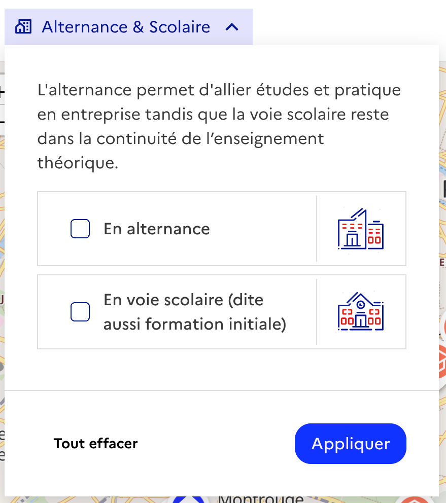
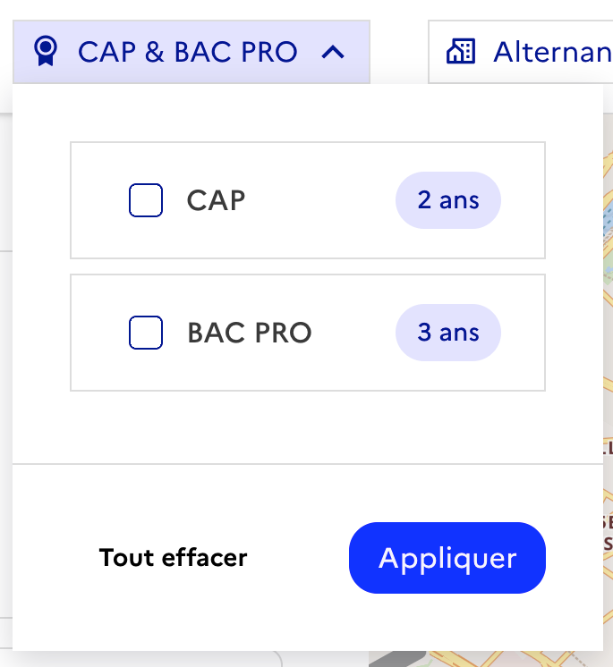
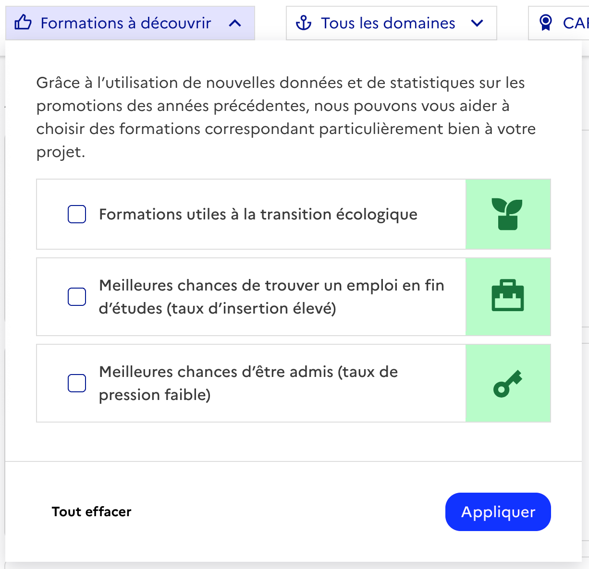
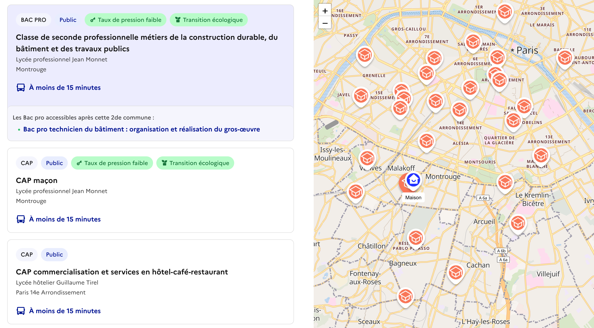

# 🔍 Page de recherche
{: .no_toc }

- TOC
{:toc}

{: .highlight}
⚡️ La page de recherche permet de renseigner une adresse et de préciser des filtres permettant d’afficher un ensemble de formations disponibles autour de l’adresse fournie et répondant aux critères sélectionnés.

## Effectuer une recherche

### Renseigner une adresse

En haut de page, un champ vous permet de **renseigner une adresse**, typiquement le domicile de l’élève ou l’adresse d’un établissement. Les résultats de recherche présenteront les **formations accessibles depuis ce lieu**.

Pour vous aider : 

- des suggestions sont proposées au fur et à mesure de la saisie
- l’option “Autour de moi” vous permet d’utiliser votre position actuelle comme adresse
- votre historique de recherche est proposé lors des nouvelles saisies

### Filtrer

Si vous avez déjà une idée du type de formations que vous recherchez, des filtres sont à votre disposition pour limiter et préciser les résultats attendus.

- Un **filtre par domaine** pour définir le (ou les) secteur(s) dans lesquels l’élève souhaite exercer son futur métier
    
    {: width="320" }
    
- Un **filtre par voie** pour préciser si l'élève s'oriente vers la voie scolaire ou l'apprentissage
    
    {: width="320" }

- Un **filtre par diplôme** si vous souhaitez cibler uniquement les CAP ou les Bac Pro
    
    {: width="320" }

- Des **filtres avancés** permettant de cibler les formations de la transition écologique, les formations à fort taux d'emploi ou à faible taux de pression
    
    {: width="320" }
    

## Parcourir les résultats de recherche

### Parcourir la liste de formations

Une fois votre recherche lancée, à partir de l’adresse renseignée et des divers filtres, un ensemble de résultats vous est proposé : 

- tout d’abord, **les formations accessibles depuis ce lieu, en moins d’une heure et demi, à pied ou en transports en commun et scolaires**
- enfin, les **autres formations disponibles, accessibles par exemple en voiture**

{: .note }
Bientôt disponible : temps de trajet en vélo et formations disposant d'un internat

Pour chaque formation, un ensemble d’informations essentielles sont affichées : 

- le nom de la **certification** (par exemple “CAP Cuisine”)
- une indication si la formation est proposée en **apprentissage** (et non en voie scolaire)
- le **nom de l’établissement** qui dispense la formation et la **ville** dans laquelle se situe cet établissement
- une indication sur le **statut public ou privé** de l’établissement
- une indication sur la **durée de trajet nécessaire pour accéder à cet établissement**
- des labels, pour mettre en avant les formations de la transition écologique, un taux de pression faible l’année précédente ou une forte insertion à l’issue de la formation

Pour les formations appartenant à des [familles de métiers](https://www.onisep.fr/formation/apres-la-3-la-voie-professionnelle/les-diplomes-de-la-voie-pro/le-bac-professionnel/les-familles-de-metiers), une seule élément correspondant à la seconde commune est affichée dans le résultat de recherche. Les Bac pro disponibles dans l’établissement à l’issue de cette seconde commune sont cependant listés en bas de la vignette.

### Situer les formations sur la carte

Une carte interactive permet de situer : 

- le lieu de la recherche (maison)
- les établissements à proximité (indicateur orange)

Un ensemble d’informations sur l’établissement est affiché au clic sur le “pin’s” correspondant

### Accéder aux pages de détail

En cliquant sur un élément de la liste, vous pouvez ouvrir une page dédiée à la formation contenant des informations détaillées : contenu de la formation, conditions d’accès, poursuite d’études possibles, accès à l’emploi.

En savoir plus sur la page de détail : [Page de détail de la formation]({{ site.baseurl }})